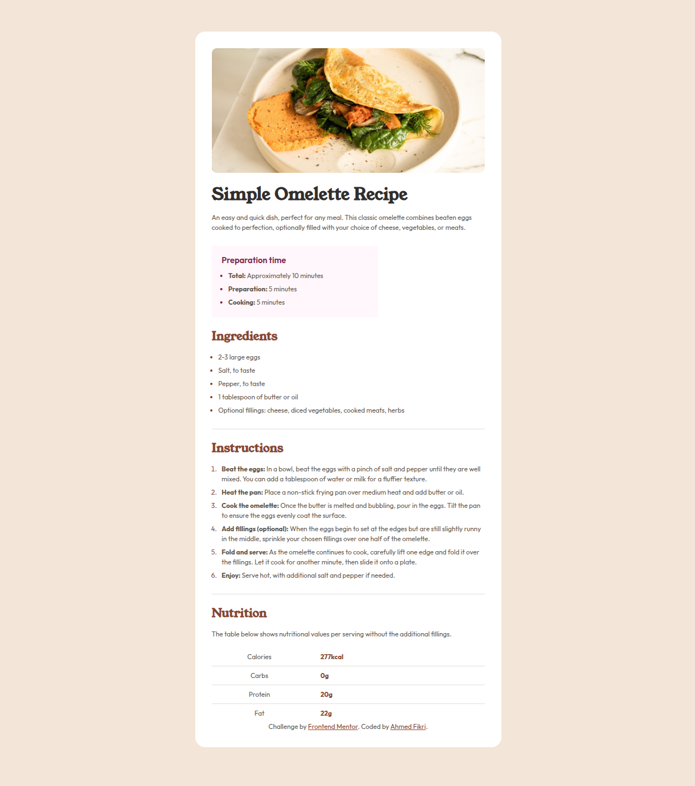

# Frontend Mentor - Recipe page solution

This is a solution to the [Recipe page challenge on Frontend Mentor](https://www.frontendmentor.io/challenges/recipe-page-KiTsR8QQKm). Frontend Mentor challenges help you improve your coding skills by building realistic projects.

## Table of contents

- [Overview](#overview)
  - [The challenge](#the-challenge)
  - [Screenshot](#screenshot)
  - [Links](#links)
- [My process](#my-process)
  - [Built with](#built-with)
  - [What I learned](#what-i-learned)
  - [Continued development](#continued-development)
- [Author](#author)

## Overview

### Screenshot



### Links

- Solution URL: [link](https://github.com/Fikri-20/Recipe-Page)
- Live Site URL: [link](https://fikri-20.github.io/Recipe-Page/)

## My process

1. I started by obeserving figma design for desktop, tablet, and mobile screens
2. I coded the HTML of the project
3. I set the fixed style-guide of the project in root element in css
4. I begin styling the card using "Mobile-First" Strategy
5. Then adjusting the responsitivity for tablet and desktop versions.

### Built with

- Semantic HTML5 markup
- CSS
- Flexbox
- CSS Grid
- Mobile-first workflowalt text

### What I learned

- This is the first time I deal with CSS grid, It helped me style columns of the last section of the card easily. setting the column gap and the percentege between the two columns.

```css
.row {
  display: grid;
  grid-template-columns: 35% 65%;
  align-items: start;
  margin: 0px 0px var(--spacing-150) 0px;

  column-gap: 2rem;
}
```

- I learned how to handle different screens in mobile-first strategy, without adopting many properties for adjusting the responsitivity.

### Continued development

I need to practice CSS grid more.

## Author

Frontend Mentor - [@Fikri-20](https://www.frontendmentor.io/profile/Fikri-20)
